# Software Requirements Specification (SRS)
## Template theo chuẩn IEEE 830

> **Document Version**: 1.0  
> **Last Updated**: 2024-01-25  
> **Project**: [Project Name]

---

## Table of Contents

1. [Introduction](#1-introduction)
2. [Overall Description](#2-overall-description)
3. [System Features](#3-system-features-functional-requirements)
4. [External Interface Requirements](#4-external-interface-requirements)
5. [Non-functional Requirements](#5-non-functional-requirements)
6. [Appendices](#6-appendices)

---

## 1. Introduction

### 1.1. Purpose

Mô tả mục đích của tài liệu SRS này và phạm vi của hệ thống.

### 1.2. Scope

Xác định phạm vi của hệ thống, các tính năng chính, và giới hạn.

### 1.3. Definitions, Acronyms, and Abbreviations

| Term | Definition |
|------|------------|
| SRS | Software Requirements Specification |
| API | Application Programming Interface |
| UI | User Interface |
| ... | ... |

### 1.4. References

- IEEE Std 830-1998 - IEEE Recommended Practice for Software Requirements Specifications
- [Other references]

### 1.5. Overview

Tổng quan về cấu trúc tài liệu này.

---

## 2. Overall Description

### 2.1. Product Perspective

#### 2.1.1. System Context Diagram

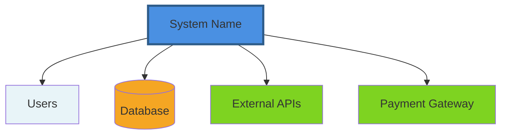

#### 2.1.2. System Interfaces

- **Hardware Interfaces**: Mô tả các giao diện phần cứng
- **Software Interfaces**: Mô tả các giao diện phần mềm
- **Communication Interfaces**: Mô tả các giao thức giao tiếp

### 2.2. Product Functions

Tổng quan về các chức năng chính của hệ thống:

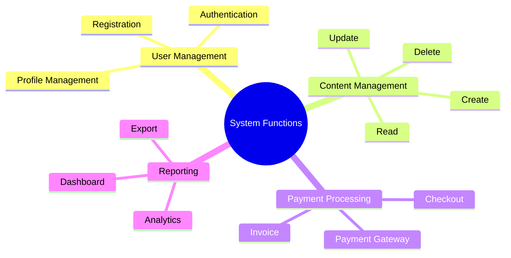

### 2.3. User Characteristics

Mô tả các loại người dùng và đặc điểm của họ:

| User Type | Characteristics | Technical Skills |
|-----------|----------------|------------------|
| End User | Basic computer skills | Low |
| Administrator | Advanced technical skills | High |
| Developer | Expert technical skills | Very High |

### 2.4. Constraints

#### 2.4.1. Regulatory Policies

- Tuân thủ GDPR
- Tuân thủ các quy định bảo mật dữ liệu

#### 2.4.2. Hardware Limitations

- Minimum RAM: 4GB
- Minimum Storage: 10GB

#### 2.4.3. Software Limitations

- Compatible với Python 3.12+
- Requires PostgreSQL 16+

#### 2.4.4. Interface Constraints

- RESTful API design
- JSON data format

### 2.5. Assumptions and Dependencies

- Internet connection required
- Modern web browser required
- Third-party services availability

---

## 3. System Features (Functional Requirements)

### 3.1. Feature 1: User Authentication

#### 3.1.1. Description

Hệ thống cho phép người dùng đăng nhập và xác thực.

#### 3.1.2. Priority

**High** - Critical for system security

#### 3.1.3. Use Case Diagram

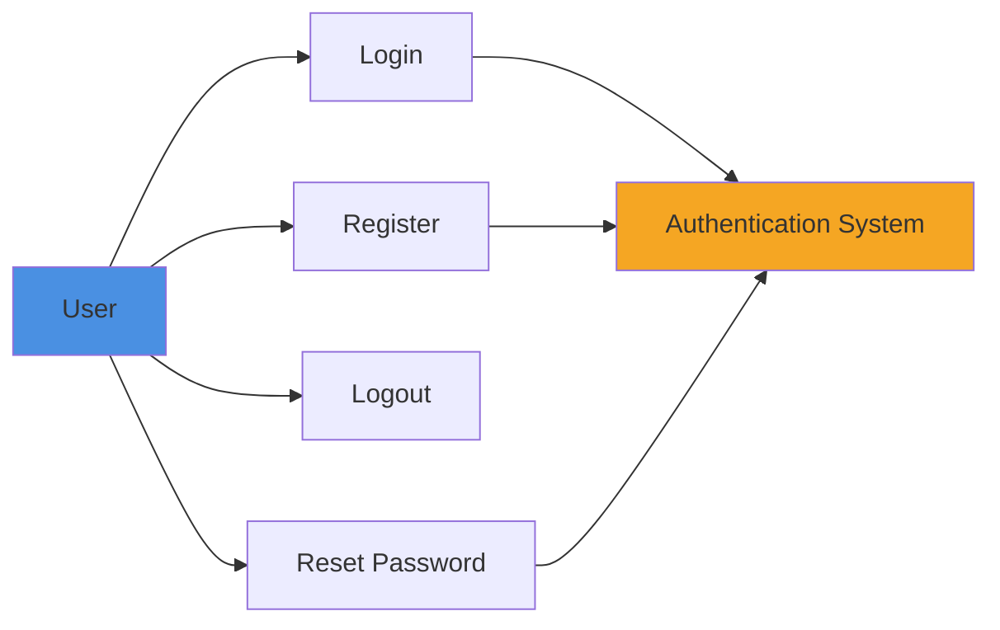

#### 3.1.4. Functional Requirements

**FR-1.1**: System shall allow users to register with email and password.

**FR-1.2**: System shall validate email format during registration.

**FR-1.3**: System shall require password with minimum 8 characters.

**FR-1.4**: System shall allow users to login with valid credentials.

**FR-1.5**: System shall implement session management.

**FR-1.6**: System shall allow users to reset forgotten passwords.

#### 3.1.5. User Stories

- **As a** user, **I want to** register an account **so that** I can access the system.
- **As a** user, **I want to** login securely **so that** my account is protected.

#### 3.1.6. Acceptance Criteria

- [ ] User can register with valid email and password
- [ ] System rejects invalid email formats
- [ ] System enforces password strength requirements
- [ ] User can login with correct credentials
- [ ] System prevents login with incorrect credentials
- [ ] Session expires after inactivity period

### 3.2. Feature 2: Content Management

#### 3.2.1. Description

Hệ thống cho phép người dùng quản lý nội dung (CRUD operations).

#### 3.2.2. Priority

**High** - Core functionality

#### 3.2.3. Activity Diagram

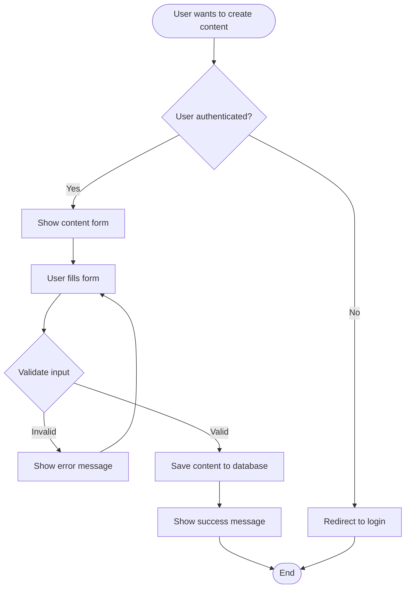

#### 3.2.4. Functional Requirements

**FR-2.1**: System shall allow authenticated users to create content.

**FR-2.2**: System shall validate content before saving.

**FR-2.3**: System shall allow users to edit their own content.

**FR-2.4**: System shall allow users to delete their own content.

**FR-2.5**: System shall display content list with pagination.

### 3.3. Feature 3: Payment Processing

#### 3.3.1. Description

Hệ thống xử lý thanh toán thông qua payment gateway.

#### 3.3.2. Priority

**Medium** - Business critical

#### 3.3.3. Sequence Diagram

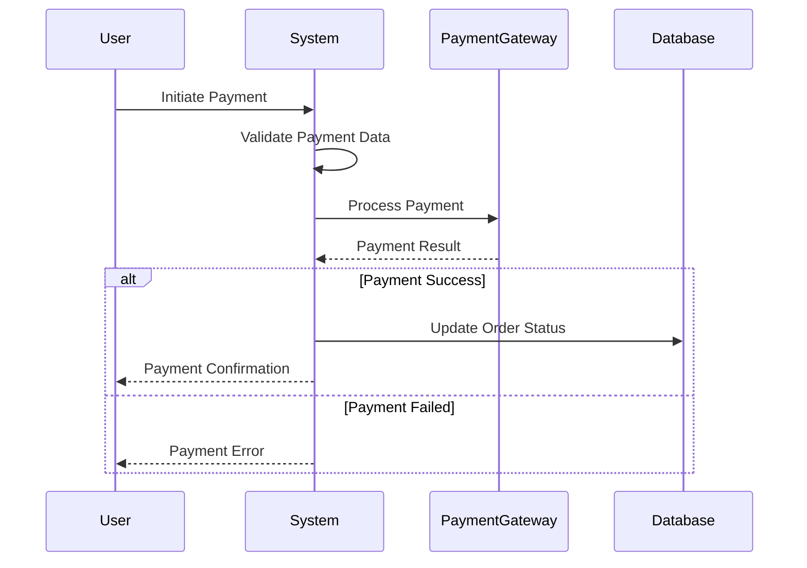

#### 3.3.4. Functional Requirements

**FR-3.1**: System shall integrate with payment gateway.

**FR-3.2**: System shall process payment transactions securely.

**FR-3.3**: System shall handle payment failures gracefully.

**FR-3.4**: System shall generate invoices after successful payment.

---

## 4. External Interface Requirements

### 4.1. User Interfaces

#### 4.1.1. UI Mockup Structure

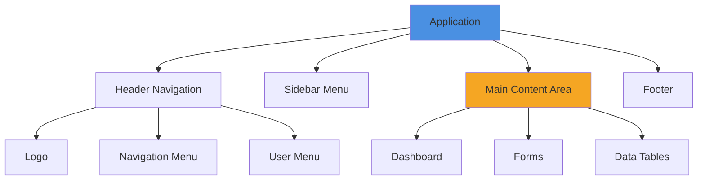

#### 4.1.2. UI Requirements

- **Responsive Design**: Support desktop, tablet, mobile
- **Browser Compatibility**: Chrome, Firefox, Safari, Edge (latest 2 versions)
- **Accessibility**: WCAG 2.1 Level AA compliance
- **Theme**: Light and dark mode support

### 4.2. Hardware Interfaces

- **Server Requirements**:**
  - CPU: 4+ cores
  - RAM: 16GB minimum
  - Storage: 100GB SSD minimum
  - Network: 1Gbps connection

### 4.3. Software Interfaces

#### 4.3.1. API Architecture

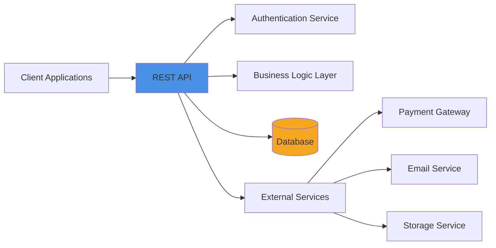

#### 4.3.2. API Endpoints

| Method | Endpoint | Description | Authentication |
|--------|----------|-------------|---------------|
| POST | `/api/auth/login` | User login | No |
| POST | `/api/auth/register` | User registration | No |
| GET | `/api/users/{id}` | Get user info | Yes |
| POST | `/api/content` | Create content | Yes |
| PUT | `/api/content/{id}` | Update content | Yes |
| DELETE | `/api/content/{id}` | Delete content | Yes |

### 4.4. Communication Interfaces

- **Protocol**: HTTPS/TLS 1.3
- **Data Format**: JSON
- **Authentication**: JWT tokens
- **Rate Limiting**: 100 requests/minute per user

---

## 5. Non-functional Requirements

### 5.1. Performance Requirements

#### 5.1.1. Response Time

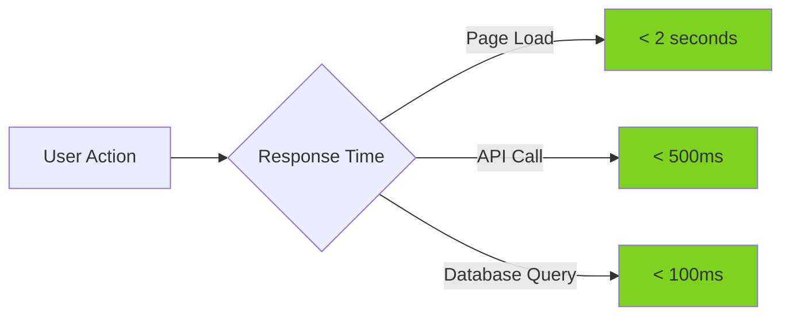

| Requirement | Target | Measurement |
|-------------|--------|-------------|
| Page Load Time | < 2 seconds | 95th percentile |
| API Response Time | < 500ms | Average |
| Database Query Time | < 100ms | Average |
| Concurrent Users | 1000+ | Peak load |

### 5.2. Security Requirements

#### 5.2.1. Security Architecture

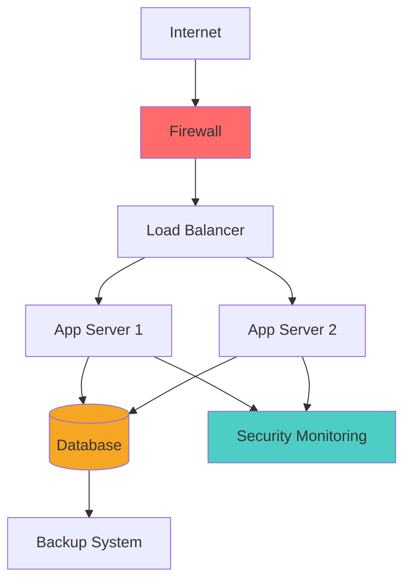

#### 5.2.2. Security Requirements

- **SR-1**: System shall encrypt sensitive data at rest (AES-256)
- **SR-2**: System shall use HTTPS for all communications
- **SR-3**: System shall implement authentication and authorization
- **SR-4**: System shall protect against SQL injection attacks
- **SR-5**: System shall protect against XSS attacks
- **SR-6**: System shall implement rate limiting
- **SR-7**: System shall log security events
- **SR-8**: System shall comply with GDPR regulations

### 5.3. Reliability Requirements

| Requirement | Target | Measurement |
|-------------|--------|-------------|
| System Uptime | 99.9% | Monthly |
| Mean Time Between Failures (MTBF) | 720 hours | Average |
| Mean Time To Repair (MTTR) | < 1 hour | Average |
| Data Backup | Daily | Automated |

### 5.4. Scalability Requirements

#### 5.4.1. Scalability Architecture

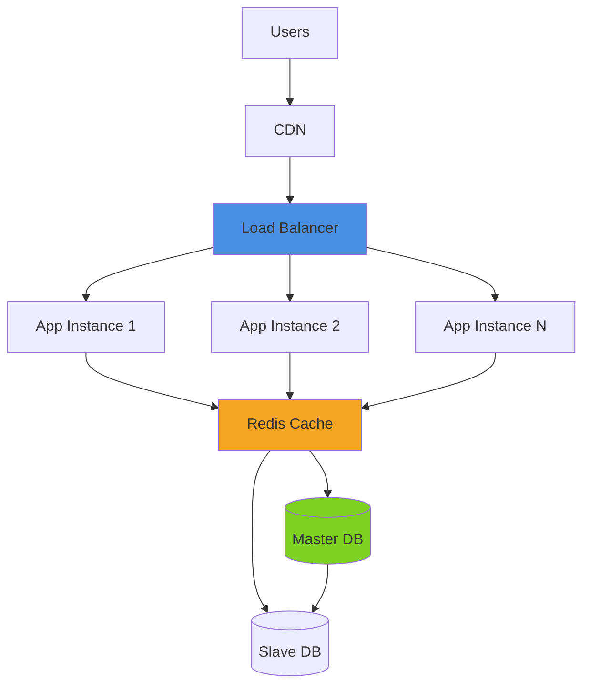

- **Horizontal Scaling**: Support multiple app instances
- **Database Scaling**: Master-slave replication
- **Caching**: Redis for session and data caching
- **Load Capacity**: Support 10,000+ concurrent users

### 5.5. Usability Requirements

- **UR-1**: System shall be intuitive for non-technical users
- **UR-2**: System shall provide help documentation
- **UR-3**: System shall support multiple languages (i18n)
- **UR-4**: System shall be accessible (WCAG 2.1 AA)

### 5.6. Portability Requirements

- **PR-1**: System shall run on Linux servers
- **PR-2**: System shall support Docker deployment
- **PR-3**: System shall be cloud-agnostic (AWS, Azure, GCP)

### 5.7. Maintainability Requirements

- **MR-1**: Code coverage > 80%
- **MR-2**: Comprehensive documentation
- **MR-3**: Modular architecture
- **MR-4**: Automated testing pipeline

---

## 6. Appendices

### 6.1. Glossary

| Term | Definition |
|------|------------|
| API | Application Programming Interface |
| CRUD | Create, Read, Update, Delete |
| JWT | JSON Web Token |
| REST | Representational State Transfer |
| UI | User Interface |
| UX | User Experience |

### 6.2. Acronyms

- **SRS**: Software Requirements Specification
- **IEEE**: Institute of Electrical and Electronics Engineers
- **GDPR**: General Data Protection Regulation
- **WCAG**: Web Content Accessibility Guidelines
- **HTTPS**: Hypertext Transfer Protocol Secure
- **TLS**: Transport Layer Security

### 6.3. Data Models

#### 6.3.1. Entity Relationship Diagram

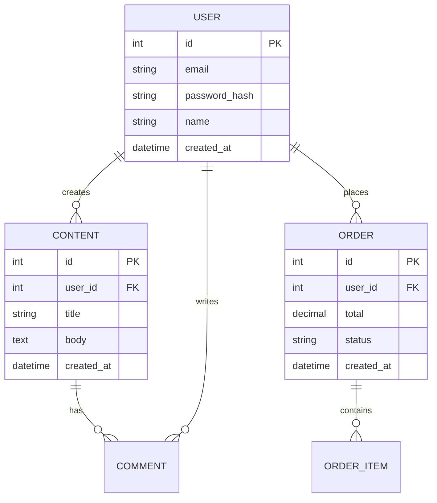

### 6.4. Use Case Descriptions

#### 6.4.1. Use Case: User Registration

**Actor**: New User  
**Precondition**: User is not registered  
**Main Flow**:
1. User navigates to registration page
2. User fills registration form
3. System validates input
4. System creates user account
5. System sends confirmation email
6. User receives confirmation

**Alternative Flows**:
- 3a. Validation fails → Show error message
- 5a. Email sending fails → Log error, account still created

**Postcondition**: User account created

### 6.5. Change Log

| Version | Date | Author | Changes |
|---------|------|--------|---------|
| 1.0 | 2024-01-25 | System | Initial version |
| 1.1 | 2024-02-01 | System | Added payment feature |
| 1.2 | 2024-02-15 | System | Updated security requirements |

### 6.6. Approval

| Role | Name | Signature | Date |
|------|------|-----------|------|
| Product Owner | | | |
| Technical Lead | | | |
| QA Lead | | | |

---

## Document Metadata

- **Document ID**: SRS-001
- **Version**: 1.0
- **Status**: Draft / Review / Approved
- **Created**: 2024-01-25
- **Last Updated**: 2024-01-25
- **Next Review**: 2024-02-25

